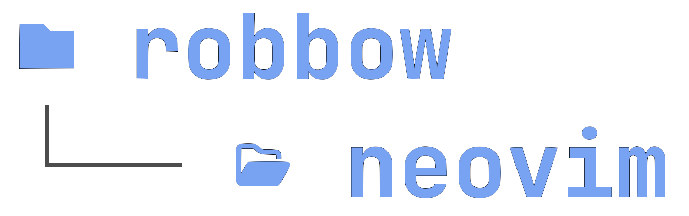

<h1 align="center">
   
</a>
   
</h1>

<h4 align="center">
<a href="https://www.robbow.land" target="_blank">My</a> <a href="https://github.com/neovim/neovim" target="_blank">neovim</a> configuration for simplicity, consistency & functionality. Standing on the shoulders of <a href="https://github.com/LazyVim/LazyVim" target="_blank">LazyVim</a>💤.
</h4>

## Themes

The default is the local `micrographics` colorscheme, which mirrors the pure-invert, grayscale-scaffolding, and danger-red language used by the Obsidian and Pi themes. The previous `github_dark_default` theme remains installed as a fallback.

Use `:set background=light | colorscheme micrographics` for positive polarity, or switch back at any time with `:colorscheme github_dark_default`.

  <a>sections</a> •
  <a>to</a> •
  <a>come</a> •
  <a>later</a>

